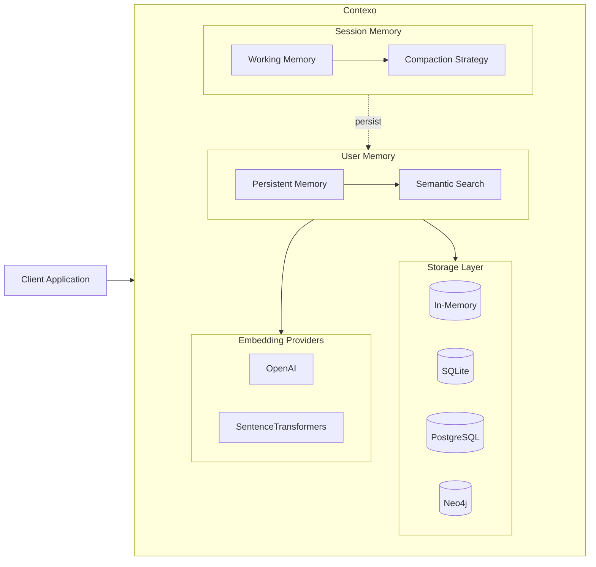
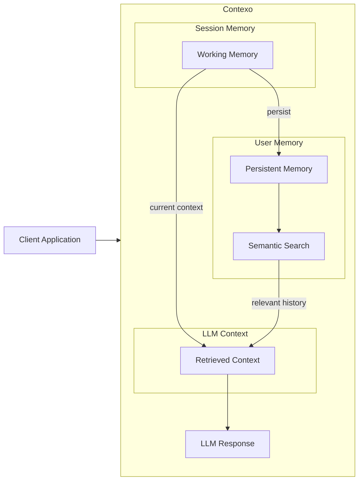

<p align="center">
  
</p>

<p align="center">
  <b><span style="font-size: 2.2em;">Context Management for LLM Applications.</span></b>
</p>


Contexo provides a two-tier memory system for managing conversation context: fast session memory for active conversations and user memory with semantic search for long-term storage.

## Architecture



### Message Flow



## Features

- **Session Memory** — Fast in-memory context with auto-compaction strategies
- **User Memory** — SQLite, PostgreSQL, and Neo4j backends for long-term storage
- **Semantic Search** — Vector similarity search using embeddings
- **Sectioned Context** — Partition memory by priority (system, user, RAG, tools)
- **Tool Tracking** — First-class support for tool calls and responses
- **Provenance** — Full audit trail of memory operations
- **Async-First** — Built on `asyncio` for non-blocking operations

## Comparison

| Library | Focus | Storage | Compaction | Async |
|---------|-------|---------|------------|-------|
| **Contexo** | Two-tier memory | SQLite, PostgreSQL, Neo4j, In-Memory | Multiple strategies | ✅ Native |
| LangChain Memory | Chain integration | In-Memory, Redis, PostgreSQL | Token limit | ⚠️ Partial |
| MemGPT | Agent memory | Local files, vector DBs | LLM summarization | ✅ Native |
| Mem0 | Memory for AI | Qdrant, Postgres, Redis | LLM-based | ✅ Native |
| LlamaIndex | RAG frameworks | Vector stores | Chunking | ✅ Native |
| Semantic Kernel | Orchestrator | In-Memory, Redis | Sliding window | ✅ Native |

**Why Contexo?**

- **Simpler than frameworks** — Drop-in library, not a full framework like Mem0 or LangChain or Semantic Kernel
- **Flexible storage** — Swap backends without code changes (SQLite → PostgreSQL → Neo4j)
- **Multiple compaction strategies** — Choose what fits your use case (FIFO, importance, summarization)
- **Sectioned memory** — Built-in support for prioritized context sections (system, user, RAG, tools)
- **Provenance tracking** — Full audit trail for debugging and compliance
- **Framework-agnostic** — Works with any LLM (OpenAI, Anthropic, local models)

## Installation

```bash
pip install contexo
```

### Optional dependencies

```bash
pip install contexo[openai]       # OpenAI embeddings
pip install contexo[embeddings]   # Sentence Transformers
pip install contexo[postgresql]   # PostgreSQL backend
pip install contexo[neo4j]        # Neo4j backend
pip install contexo[all]          # All extras
```

## Quick Start

```python
import asyncio
from contexo import Contexo
from contexo.config.defaults import minimal_config

async def main():
    ctx = Contexo(config=minimal_config())
    await ctx.initialize()

    await ctx.add_message("user", "My favorite color is blue")
    await ctx.add_message("assistant", "I'll remember that.")

    context = await ctx.get_context()
    print(context)

    await ctx.close()

asyncio.run(main())
```

## User Memory

Use user memory to maintain conversation history across sessions:

```python
from contexo.config.defaults import local_config

ctx = Contexo(config=local_config())
await ctx.initialize()

await ctx.add_message("user", "I prefer Python over JavaScript")

# Clear session memory, but user memory remains
await ctx.clear_working_memory()

# Retrieve from user memory via semantic search
results = await ctx.search_memory("programming languages")
```

## Storage Backends

| Backend | Package | Use Case |
|---------|---------|----------|
| In-Memory | built-in | Testing, prototypes |
| SQLite | built-in | Local apps, single instance |
| PostgreSQL | `[postgresql]` | Production, cloud |
| Neo4j | `[neo4j]` | Relationship queries |

## Sectioned Memory

Organize context into prioritized sections for chat applications:

```python
from contexo.config.defaults import chat_config

ctx = Contexo(config=chat_config())
await ctx.initialize()

# System prompt (pinned, never evicted)
await ctx.add_message("system", "You are a helpful assistant.", section="system")

# User profile (high priority)
await ctx.add_message("user", "My name is Alice.", section="user_profile")

# Regular conversation (normal priority)
await ctx.add_message("user", "What's the weather?", section="conversation")

# RAG context (low priority)
await ctx.add_message("system", "User likes hiking.", section="rag_context")
```

Sections: `system`, `user_profile`, `conversation`, `rag_context`, `tools`

## Compaction Strategies

Choose what to keep when session memory fills:

```python
from contexo.working_memory.strategies import ImportanceCompactionStrategy

config = minimal_config()
config.compaction_strategy = ImportanceCompactionStrategy(threshold=0.5)

ctx = Contexo(config=config)

await ctx.add_message("user", "Casual chat", importance=0.3)
await ctx.add_message("user", "API key: xyz123", importance=0.9)
# High-importance entries are preserved
```

Available strategies:
- `SlidingWindowCompactionStrategy` — FIFO eviction
- `ImportanceCompactionStrategy` — Priority-based eviction
- `SummarizationCompactionStrategy` — Summarize old entries

## Tool Calls

Track tool usage with automatic parent-child linking:

```python
await ctx.add_tool_call(
    tool_name="get_weather",
    arguments={"location": "San Francisco", "units": "celsius"}
)

await ctx.add_tool_response(
    tool_name="get_weather",
    result={"temp": 18, "condition": "sunny"}
)
```

## Configuration

Pre-configured presets for common scenarios:

```python
from contexo.config.defaults import (
    minimal_config,      # In-memory only
    local_config,        # SQLite + local embeddings
    cloud_config,        # PostgreSQL + OpenAI
    chat_config,         # Sectioned memory for chat
)
```

Full customization:

```python
from contexo.config.settings import ContexoConfig
from contexo.storage.sqlite import SQLiteStorage
from contexo.embeddings.openai import OpenAIEmbeddingProvider

config = ContexoConfig(
    storage_backend=SQLiteStorage(database_path="app.db"),
    embedding_provider=OpenAIEmbeddingProvider(model="text-embedding-3-small"),
    working_memory_max_tokens=4000,
)
```

## Integrations

### LangChain

```python
from contexo.integrations.langchain_memory import ContexoMemory
from langchain.chains import ConversationChain

memory = ContexoMemory(config=local_config())
await memory.initialize()

chain = ConversationChain(llm=llm, memory=memory)
```

See `examples/` for complete integration examples with OpenAI, Anthropic, and more.

## Documentation

- [Examples](examples/) — Usage examples and tutorials
- [API Reference](https://docs.contexo.dev) — Full API documentation (coming soon)

## Development

```bash
# Clone repo
git clone https://github.com/yourusername/contexo.git
cd contexo

# Install in development mode
pip install -e ".[all,dev]"

# Install pre-commit hooks (optional)
pre-commit install

# Run all checks (lint, format, test)
./scripts/check.sh
```

# Pre-commit hooks (optional)
pip install pre-commit && pre-commit install

# Run checks manually
./scripts/check.sh
```
```

## Contributing

Contributions are welcome! Please see [CONTRIBUTING.md](CONTRIBUTING.md) for guidelines.

## License

