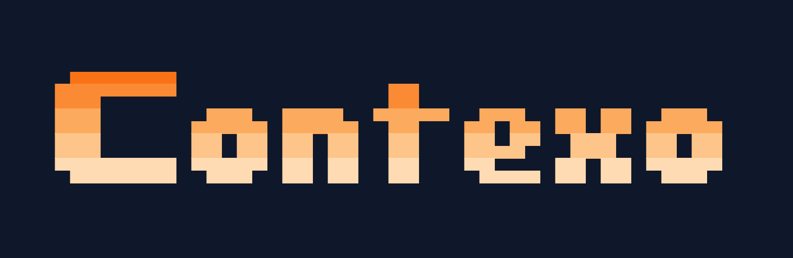
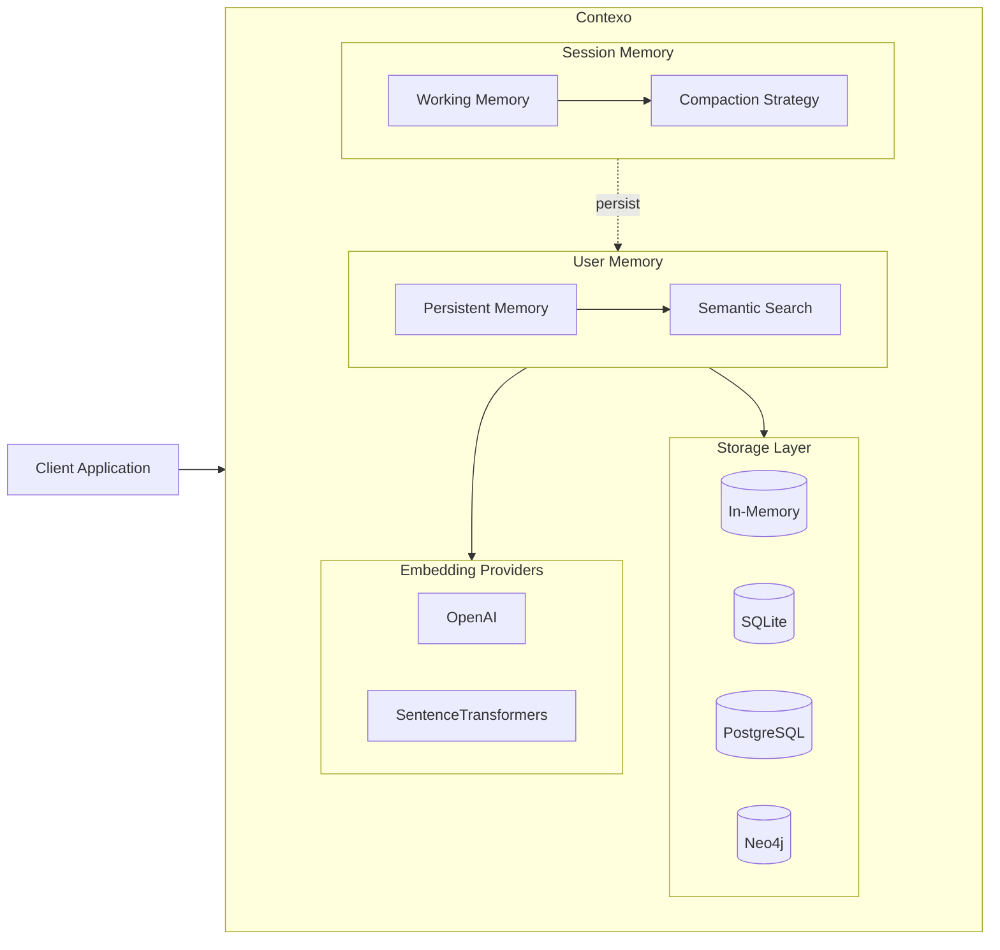
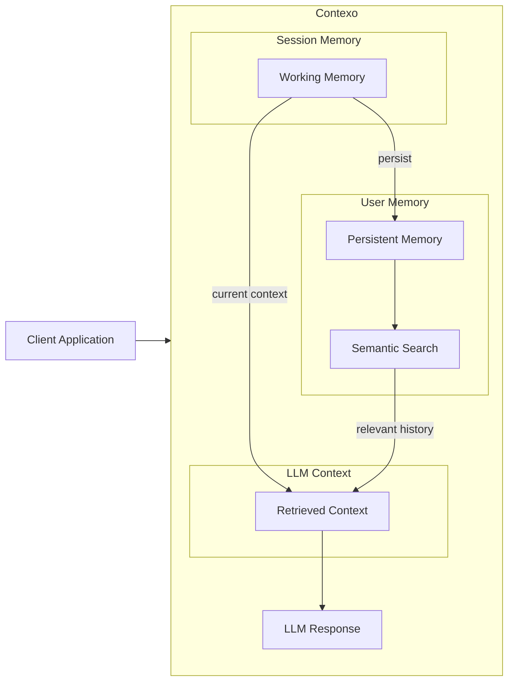
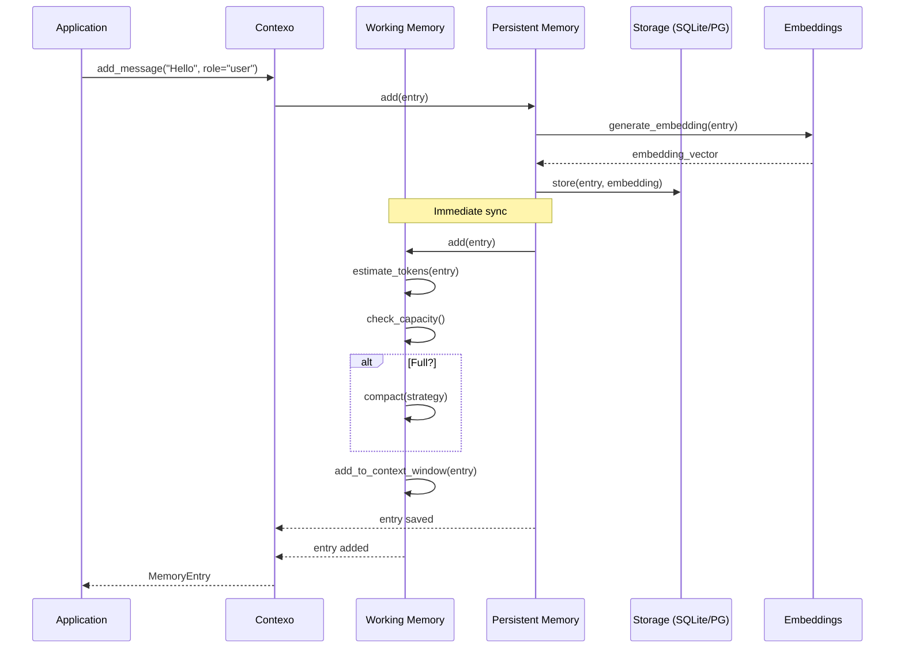
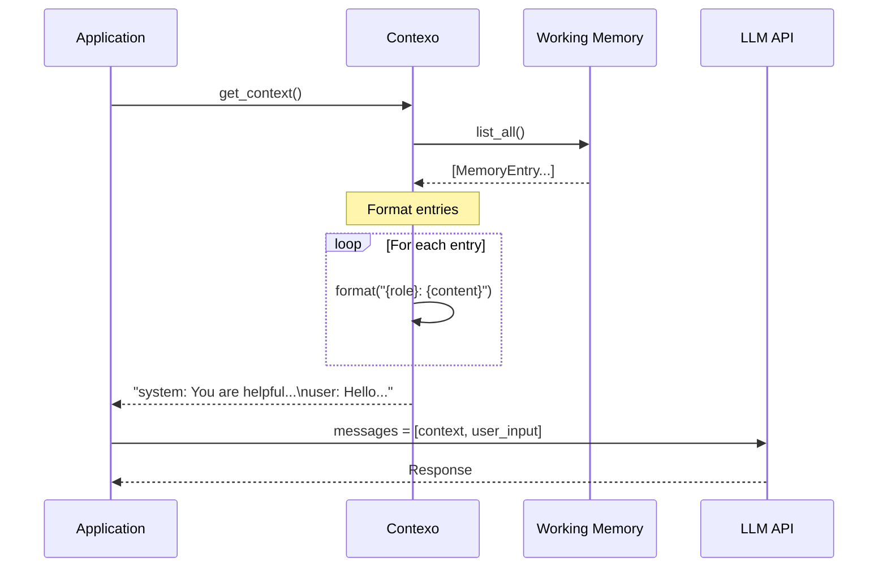
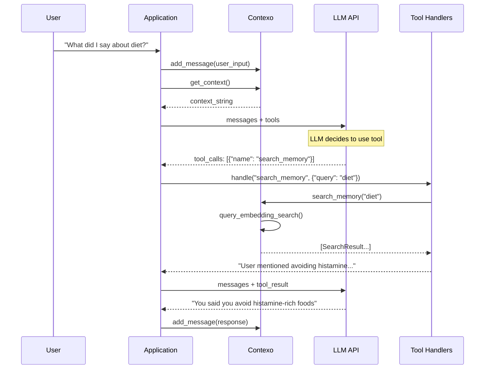
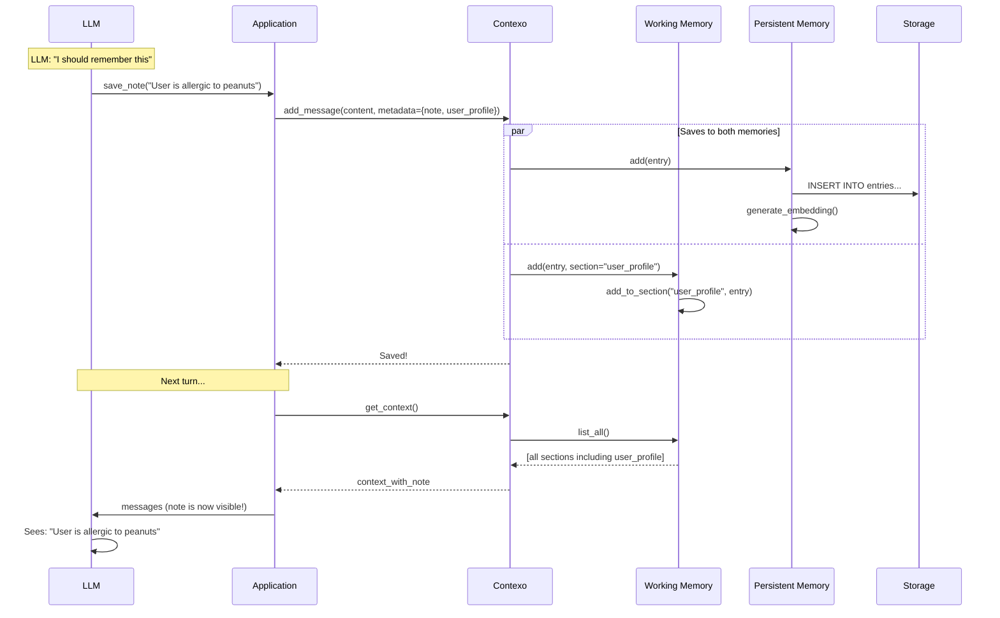
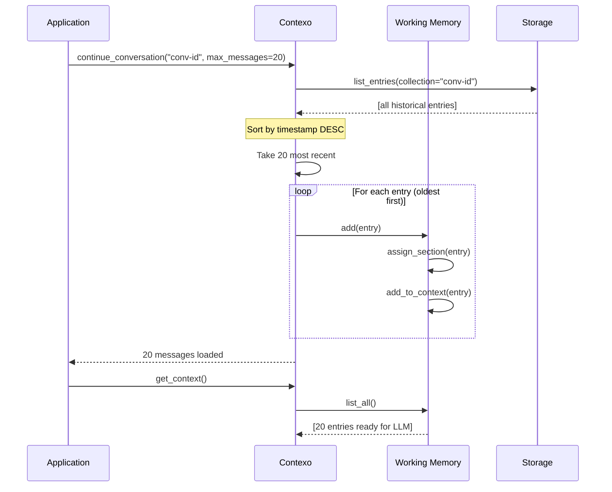
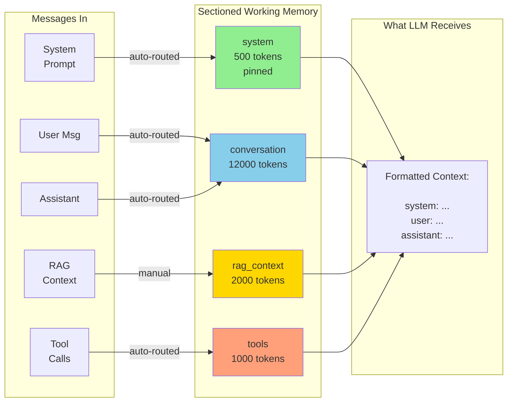

<p align="center">
  
</p>

<p align="center">
  <b><span style="font-size: 2.8em;">Context Management for LLM Applications</span></b>
</p>


Contexo is a memory management library that provides a two-tier memory system for managing conversation context: fast session memory, persistent memory, and semantic search for LLM applications.

## Table of Contents

- [Features](#features)
- [Why Contexo](#why-contexo)
- [LoCoMo Benchmark](#locomo-benchmark)
- [LongMemEval Benchmark](#longmemeval-benchmark)
- [Installation](#installation)
- [Quick Start](#quick-start)
- [Architecture](#architecture)
- [How It Works](#how-it-works)
- [User Memory](#user-memory)
- [Storage Backends](#storage-backends)
- [Sectioned Memory](#sectioned-memory)
- [Working Memory Snapshots](#working-memory-snapshots)
- [Compaction Strategies](#compaction-strategies)
- [Tool Calls](#tool-calls)
- [LLM Tool Integration](#llm-tool-integration)
- [Configuration](#configuration)
- [Observability](#observability)
- [Multi-Agent Systems](#multi-agent-systems)
- [Integrations](#integrations)
- [Development](#development)
- [Contributing](#contributing)
- [License](#license)

## Features

- **Session Memory** — Fast in-memory context with auto-compaction strategies
- **User Memory** — SQLite, PostgreSQL, and Neo4j backends for long-term storage
- **Semantic Search** — Vector similarity search using embeddings
- **Sectioned Context** — Partition memory by priority (system, user, RAG, tools)
- **Multi-Agent Support** — Shared context with private agent thoughts
- **Tool Tracking** — First-class support for tool calls and responses
- **Provenance** — Full audit trail of memory operations
- **Async-First** — Built on `asyncio` for non-blocking operations

## Why Contexo?

| Feature | Contexo | Acontext | MemU | LangChain | MemGPT | Mem0 |
|---------|---------|----------|------|-----------|--------|------|
| **Type** | ✅ Drop-in library | ⚠️ Platform/Infra | ⚠️ Framework | ❌ Framework | ❌ Framework | ⚠️ Platform |
| **Scope** | ✅ Memory management | ⚠️ Context infrastructure | ✅ Agentic memory | ❌ Chain integration | ❌ Agent memory | ⚠️ AI memory |
| **Memory model** | ✅ 2-tier (Working + Persistent) | ⚠️ Sessions | ✅ 3-layer (Resource → Item → Category) | ⚠️ Basic | ⚠️ Layers | ⚠️ Cloud |
| **Self-hosted** | ✅ Local or Cloud (PG/Neo4j) | ❌ Cloud (PostgreSQL) | ✅ Yes | ✅ Yes | ✅ Local | ❌ Cloud (DBs) |
| **Data types** | ⚠️ Text (messages) | ✅ Text, images, files, tools | ✅ Multi-modal (text, images, audio, video) | ⚠️ Messages | ⚠️ Messages | ⚠️ Messages |
| **Storage flexibility** | ✅ SQLite/PG/Neo4j/In-Memory (local or cloud) | ⚠️ PostgreSQL only | ⚠️ File-based + DB | ⚠️ Limited | ❌ Files only | ⚠️ Vector DBs |
| **Compaction** | ✅ 4+ strategies | ⚠️ LRU/deletion | ❌ N/A (different approach) | ❌ Token limit | ✅ Summarization | ✅ LLM-based |
| **Sectioned memory** | ✅ Built-in sections | ⚠️ Via spaces/artifacts | ✅ Built-in categories | ❌ Manual | ❌ Manual | ❌ Manual |
| **Provenance** | ✅ Full audit trail | ⚠️ Task tracking | ✅ Full traceability | ❌ No | ⚠️ Basic | ⚠️ Basic |
| **Retrieval** | ✅ Semantic search | ⚠️ pgvector | ✅ **RAG + LLM file reading** | ⚠️ Via vector store | ⚠️ Via add-ons | ✅ Core feature |
| **Tool tracking** | ✅ First-class | ✅ First-class | ❌ N/A | ⚠️ Via agent | ✅ Supported | ❌ No |
| **Self-evolving** | ❌ No | ❌ No | ✅ **Yes** | ❌ No | ❌ No | ❌ No |
| **Languages** | ⚠️ Python | ✅ Python + TypeScript | ⚠️ Python | ⚠️ Python | ⚠️ Python | ⚠️ Python |
| **Async-native** | ✅ Full async | ✅ Full async | ✅ Full async | ⚠️ Partial | ✅ Full async | ✅ Full async |

| **Search scope** | ✅ **All conversations, global** | ⚠️ Within space only | ⚠️ Within scope | ❌ Per memory | ❌ Limited | ❌ Per memory |
| **Hybrid search** | ✅ **Semantic + FTS fallback** | ❌ Vector only | ✅ **RAG + LLM-based** | ⚠️ Vector only | ⚠️ Vector only | ⚠️ Vector only |

**Key differentiators:**

- **Flexible semantic search** — Pluggable providers (OpenAI, SentenceTransformers, custom), search across ALL conversations
- **Local-first** — Run anywhere without cloud dependencies (SQLite, Neo4j, In-Memory)
- **Sectioned memory** — Organize by priority (system → user → conversation → RAG)
- **Provenance tracking** — Full audit trail for debugging
- **Flexible storage** — Swap backends without code changes

## LoCoMo Benchmark

Contexo was evaluated on the [LoCoMo benchmark](https://github.com/snap-research/locomo), which tests long-term conversational memory retrieval accuracy by measuring whether semantic search can find relevant information from a long conversation history.

### Performance Comparison

Contexo achieves **95.22% accuracy**, beating MemU's 92.09% baseline.

```
Accuracy on LoCoMo Benchmark (QA Retrieval)

100% ┤
     │
 95% ┤    ██ 95.22%
     │    ██
 92% ┤    ██  ██ 92.09%
     │    ██  ██
     └────┴────┴─────
       Contexo MemU
```

### Detailed Results

| Sample | Accuracy | Correct | Total |
|--------|----------|---------|-------|
| conv-43 | **99.2%** | 240 | 242 |
| conv-44 | 98.1% | 155 | 158 |
| conv-26 | 96.5% | 192 | 199 |
| conv-42 | 95.8% | 161 | 168 |
| conv-41 | 94.9% | 130 | 137 |
| conv-45 | 94.7% | 162 | 171 |
| conv-47 | 94.2% | 163 | 173 |
| conv-46 | 94.0% | 141 | 150 |
| conv-48 | 92.6% | 211 | 228 |
| conv-40 | 84.6% | 236 | 279 |
| **Overall** | **95.22%** | **1891** | **1986** |

### Configuration Used

- **Embedding Model**: BAAI/bge-large-en-v1.5 (Sentence Transformers, free/local)
- **Storage**: SQLite with FTS5 full-text search
- **Hybrid Search**: Semantic (2.0) + BM25 (0.3) + Substring (0.3)
- **Temporal Reranking**: Enabled (boost for session metadata + temporal words)
- **Retrieval Limit**: 200 candidates

### Key Achievements

- **Beat MemU by 3.13 percentage points** (95.22% vs 92.09%)
- **>9x better than random baseline** (~10%)
- **Open-source, local embeddings** — No API costs, self-hosted
- **Configurable retrieval** — Production-ready settings vs. benchmark tuning

### Running the Benchmark

```bash
# Download LoCoMo data
cd benchmarks/data
curl -L https://github.com/snap-research/locomo/raw/main/data/locomo10.json -o locomo10.json

# Run evaluation (uses free local embeddings)
cd ..
python locomo_eval.py
```

**Note**: The evaluation uses a high retrieval limit (200) for maximum accuracy. For production, use the default `RetrievalConfig` settings (`default_limit=10`) for optimal performance.

## LongMemEval Benchmark

Contexo was evaluated on [LongMemEval](https://github.com/xiaowu0162/LongMemEval), which tests long-term interactive memory across 5 core abilities:
- **Information Extraction** — Finding relevant details from conversation history
- **Multi-Session Reasoning** — Connecting information across multiple sessions
- **Knowledge Updates** — Handling evolving information over time
- **Temporal Reasoning** — Understanding time-based context
- **Abstention** — Recognizing when information is unavailable

### Performance Summary

Contexo achieves **98.33% evidence recall** on LongMemEval, successfully retrieving relevant context from hundreds of chat sessions.

| Question Type | Recall | Found | Total |
|---------------|--------|-------|-------|
| **Multi-session** | 100.00% | 50 | 50 |
| **Single-session-user** | 97.14% | 68 | 70 |
| **Overall** | **98.33%** | **118** | **120** |

### Configuration Used

- **Embedding Model**: BAAI/bge-large-en-v1.5 (Sentence Transformers, free/local)
- **Storage**: SQLite with FTS5 full-text search
- **Hybrid Search**: Semantic + BM25 + Substring matching
- **Retrieval Limit**: 50 candidates per query

### Running the Benchmark

```bash
# Download LongMemEval data
cd benchmarks/data
wget https://huggingface.co/datasets/xiaowu0162/longmemeval-cleaned/resolve/main/longmemeval_s_cleaned.json

# Run evaluation (uses free local embeddings)
cd ..
python longmemeval_eval.py --max-questions=120

# Evaluate all 500 questions
python longmemeval_eval.py --all
```

**Note**: LongMemEval tests persistent memory retrieval accuracy — finding relevant information stored across hundreds of historical sessions. This differs from LoCoMo, which tests retrieval within a single long conversation.

## Alignment with OpenAI's Memory Layers

[OpenAI's in-house data agent](https://openai.com/index/inside-our-in-house-data-agent/) uses multiple context layers for reliable analytics. Contexo's design aligns with several key concepts:

| OpenAI's Layer | Contexo Equivalent |
|----------------|-------------------|
| **Metadata grounding** | Entry metadata (role, type, section) |
| **Query inference** | `search_memory()` with semantic search |
| **Curated descriptions** | Manual entries via `add_message()` |
| **Institutional memory** | Persistent memory with cross-conversation search |
| **Scoped memory** | `agent_id` + `scope` metadata filtering |
| **Runtime context** | Working memory (fast, in-memory) |

**Key similarities:**
- **Scoped memory** — Separate global (shared) and personal (agent-specific) context
- **Semantic search** — RAG-based retrieval finds relevant context automatically
- **Multi-layer context** — Sectioned memory (system, conversation, RAG, tools)

---

**Acontext** is ideal for production multi-agent systems needing rich data types and infrastructure. **MemU** excels at long-term agent memory and skill extraction. **Contexo** is ideal for drop-in memory management in LLM applications.

## Installation

```bash
pip install contexo
```

### Optional dependencies

```bash
pip install contexo[openai]       # OpenAI embeddings
pip install contexo[embeddings]   # Sentence Transformers
pip install contexo[postgresql]   # PostgreSQL backend
pip install contexo[neo4j]        # Neo4j backend
pip install contexo[opentelemetry] # OpenTelemetry tracing
pip install contexo[all]          # All extras
```

## Quick Start

```python
import asyncio
from contexo import Contexo
from contexo.config.defaults import minimal_config

async def main():
    ctx = Contexo(config=minimal_config())
    await ctx.initialize()

    await ctx.add_message("user", "My favorite color is blue")
    await ctx.add_message("assistant", "I'll remember that.")

    context = await ctx.get_context()
    print(context)

    await ctx.close()

asyncio.run(main())
```

## Architecture



### Message Flow



## How It Works

### Adding Messages



### Context Retrieval (what LLM sees)



### LLM Tool Calling



### Saving Notes (persistent + working)



### Resuming Conversations



### Sectioned Memory Flow



## User Memory

Use user memory to maintain conversation history across sessions:

```python
from contexo.config.defaults import local_config

ctx = Contexo(config=local_config())
await ctx.initialize()

await ctx.add_message("user", "I prefer Python over JavaScript")

# Clear session memory, but user memory remains
await ctx.clear_working_memory()

# Retrieve from user memory via semantic search
results = await ctx.search_memory("programming languages")
```

## Storage Backends

| Backend | Package | Use Case |
|---------|---------|----------|
| In-Memory | built-in | Testing, prototypes |
| SQLite | built-in | Local apps, single instance |
| PostgreSQL | `[postgresql]` | Production, cloud |
| Neo4j | `[neo4j]` | Relationship queries |

## Sectioned Memory

Organize context into prioritized sections for chat applications:

```python
from contexo.config.defaults import chat_config

ctx = Contexo(config=chat_config())
await ctx.initialize()

# System prompt (pinned, never evicted)
await ctx.add_message("system", "You are a helpful assistant.", section="system")

# User profile (high priority)
await ctx.add_message("user", "My name is Alice.", section="user_profile")

# Regular conversation (normal priority)
await ctx.add_message("user", "What's the weather?", section="conversation")

# RAG context (low priority)
await ctx.add_message("system", "User likes hiking.", section="rag_context")
```

Sections: `system`, `user_profile`, `conversation`, `rag_context`, `tools`

## Working Memory Snapshots

Working memory is in-memory and lost when your application stops. Snapshots preserve the working memory state for crash recovery and conversation resumption.

**What gets saved:**
- Entry IDs currently in working memory (order preserved)
- Section assignments (which entries belong to which section)
- Token counts for each entry
- LLM-generated context briefing (topic, decisions, next steps)

**When snapshots are saved:**

| Trigger | Description |
|---------|-------------|
| **Periodic** | Every N messages (default: 10) |
| **On close** | Graceful shutdown |
| **After compaction** | When working memory compresses entries |
| **Manual** | Call `save_working_memory_snapshot()` anytime |

**Context briefing for LLM continuity:**

When resuming a conversation, the snapshot includes a context briefing that helps the LLM understand:
- **Topic** — What was being discussed
- **Current state** — Where the conversation left off
- **Decisions made** — Key decisions extracted from the conversation
- **Next steps** — Planned actions (if LLM-generated)
- **Open questions** — Unresolved topics

**Restoring from snapshot:**

When you call `continue_conversation()`, Contexo automatically:
1. Looks for the latest snapshot
2. Restores working memory state (entries, sections, token counts)
3. Provides the context briefing for LLM context
4. Falls back to loading recent messages if no snapshot exists

**Configuration:**

Snapshot behavior is configurable via `SnapshotConfig`:
- Enable/disable auto-snapshot
- Snapshot interval (every N messages)
- Maximum snapshots to keep (for rollback)
- Briefing length (compact, standard, detailed)
- Debounce delay to prevent excessive snapshots during rapid message bursts

## Compaction Strategies

Choose what to keep when session memory fills:

```python
from contexo.working_memory.strategies import ImportanceCompactionStrategy

config = minimal_config()
config.compaction_strategy = ImportanceCompactionStrategy(threshold=0.5)

ctx = Contexo(config=config)

await ctx.add_message("user", "Casual chat", importance=0.3)
await ctx.add_message("user", "API key: xyz123", importance=0.9)
# High-importance entries are preserved
```

Available strategies:
- `SlidingWindowCompactionStrategy` — FIFO eviction
- `ImportanceCompactionStrategy` — Priority-based eviction
- `SummarizationCompactionStrategy` — Summarize old entries

## Tool Calls

Track tool usage with automatic parent-child linking:

```python
await ctx.add_tool_call(
    tool_name="get_weather",
    arguments={"location": "San Francisco", "units": "celsius"}
)

await ctx.add_tool_response(
    tool_name="get_weather",
    result={"temp": 18, "condition": "sunny"}
)
```

## LLM Tool Integration

Contexo can expose memory management as tools to LLMs for autonomous control:

```python
import json
from openai import AsyncOpenAI
from contexo import Contexo, local_config

contexo = Contexo(config=local_config())
await contexo.initialize()

# Define tools for LLM
tools = [
    {
        "type": "function",
        "function": {
            "name": "search_memory",
            "description": "Search past conversation history",
            "parameters": {
                "type": "object",
                "properties": {
                    "query": {"type": "string", "description": "Search query"}
                },
                "required": ["query"]
            }
        }
    },
    {
        "type": "function",
        "function": {
            "name": "save_note",
            "description": "Save important information to memory",
            "parameters": {
                "type": "object",
                "properties": {
                    "content": {"type": "string", "description": "Information to save"}
                },
                "required": ["content"]
            }
        }
    }
]

client = AsyncOpenAI()
response = await client.chat.completions.create(
    model="gpt-4",
    messages=[...],
    tools=tools
)

# Handle tool calls
if response.choices[0].message.tool_calls:
    for tool_call in response.choices[0].message.tool_calls:
        if tool_call.function.name == "search_memory":
            results = await contexo.search_memory(
                query=json.loads(tool_call.function.arguments)["query"]
            )
        elif tool_call.function.name == "save_note":
            await contexo.add_message(
                content=json.loads(tool_call.function.arguments)["content"],
                role="system",
                metadata={"type": "note", "section": "user_profile"}
            )
```

**Recommended approach:** Handle core conversation flow in code, expose search/note tools to LLM for autonomous use.

## Configuration

Pre-configured presets for common scenarios:

```python
from contexo.config.defaults import (
    minimal_config,      # In-memory only
    local_config,        # SQLite + local embeddings
    cloud_config,        # PostgreSQL + OpenAI
    chat_config,         # Sectioned memory for chat
)
```

Full customization:

```python
from contexo.config.settings import ContexoConfig
from contexo.storage.sqlite import SQLiteStorage
from contexo.embeddings.openai import OpenAIEmbeddingProvider

config = ContexoConfig(
    storage_backend=SQLiteStorage(database_path="app.db"),
    embedding_provider=OpenAIEmbeddingProvider(model="text-embedding-3-small"),
    working_memory_max_tokens=4000,
)
```

## Observability

### OpenTelemetry Tracing

Contexo supports OpenTelemetry tracing for observability. All memory operations are automatically traced when enabled.

```python
from contexo.tracing import setup_tracing
from contexo import Contexo, local_config

# Setup tracing (once at application startup)
setup_tracing(
    service_name="my-app",
    endpoint="http://localhost:4317",  # OTLP endpoint
)

# Or for development - print to console
setup_tracing(service_name="my-app", console=True)

ctx = Contexo(config=local_config())
await ctx.initialize()

# All operations are now traced
await ctx.add_message("Hello!", role="user")
results = await ctx.search_memory("greeting")
```

**Install tracing support:**
```bash
pip install contexo[opentelemetry]
```

**Traced operations:**
- `add_message` — Message additions
- `add_tool_call` / `add_tool_response` — Tool operations
- `get_context` — Context retrieval
- `search_memory` — Semantic search queries
- `promote_relevant` — Memory promotion

**Spans include attributes:**
- `conversation_id` — Conversation identifier
- `entry_type` — Type of entry (message, tool_call, etc.)
- `role` — Message role (user, assistant, system)
- `search.query` — Search query text
- `result.count` — Number of results returned

**Example trace output (console):**
```json
{
  "name": "contexo.add_message",
  "context": {
    "trace_id": "0x4bf92f3577b34da6a3ce929d0e0e4736",
    "span_id": "0x00f067aa0ba902b7"
  },
  "attributes": {
    "conversation_id": "conv-123",
    "entry_type": "message",
    "role": "user"
  }
}
```

**Viewing traces:**
- **Jaeger UI** — http://localhost:16686 (run `docker run -p 16686:16686 -p 4317:4317 jaegertracing/all-in-one`)
- **Grafana Tempo** — Query and visualize traces
- **Any OTLP backend** — Send to your observability platform

## Multi-Agent Systems

Contexo supports multi-agent scenarios where multiple agents need to collaborate while maintaining private thoughts:

```python
from dataclasses import replace
from contexo import Contexo
from contexo.config.defaults import local_config

# Enable multi-agent mode
config = replace(local_config(), multi_agent=True)
ctx = Contexo(config=config)
await ctx.initialize()

# Agent 1: Researcher adds a private thought
await ctx.add_thought(
    "User prefers Python over JavaScript",
    agent_id="researcher"
)

# Agent 1 adds a shared contribution
await ctx.add_contribution(
    "Recommended Python stack: FastAPI + SQLAlchemy",
    agent_id="researcher"
)

# Agent 2: Architect makes a decision
await ctx.add_decision(
    "DECISION: Using FastAPI for the backend",
    agent_id="architect"
)

# Get what each agent sees
researcher_view = await ctx.get_agent_context("researcher", scope="all")  # Private + shared
shared_only = await ctx.get_agent_context("researcher", scope="shared")   # Only shared
```

**Message Scopes:**
- `thought` — Private reasoning (visible only to that agent)
- `contribution` — Shared information (visible to all agents)
- `decision` — High-priority shared outcome

**Context Views:**
- `scope="all"` — Agent's private thoughts + shared context
- `scope="shared"` — Only shared context (contributions, decisions)
- `scope="private"` — Only this agent's private thoughts

**Corrections & Learning:**

```python
# Save a correction for future use (OpenAI: "Memories can also be manually created")
await ctx.add_message(
    content="For 'user count' queries, always filter by logged_in=true",
    metadata={
        "type": "correction",
        "scope": "shared",  # Available to all agents
        "original_query": "user count"
    },
    importance=0.9
)

# Retrieve with relevant corrections surfaced first
corrections = await ctx.search_memory("user count", limit=3)
context = await ctx.get_context()
```

## Integrations

### LangChain

```python
from contexo.integrations.langchain_memory import ContexoMemory
from langchain.chains import ConversationChain

memory = ContexoMemory(config=local_config())
await memory.initialize()

chain = ConversationChain(llm=llm, memory=memory)
```

See `examples/` for complete integration examples with OpenAI, Anthropic, and more.

## Documentation

- [Examples](examples/) — Usage examples and tutorials
- [API Reference](https://docs.contexo.dev) — Full API documentation (coming soon)

## Development

```bash
# Clone repo
git clone https://github.com/yourusername/contexo.git
cd contexo

# Install in development mode
pip install -e ".[all,dev]"

# Install pre-commit hooks (optional)
pre-commit install

# Run all checks (lint, format, test)
./scripts/check.sh
```

## Contributing

Contributions are welcome! Please see [CONTRIBUTING.md](CONTRIBUTING.md) for guidelines.

## License

MIT License - see LICENSE file for details.